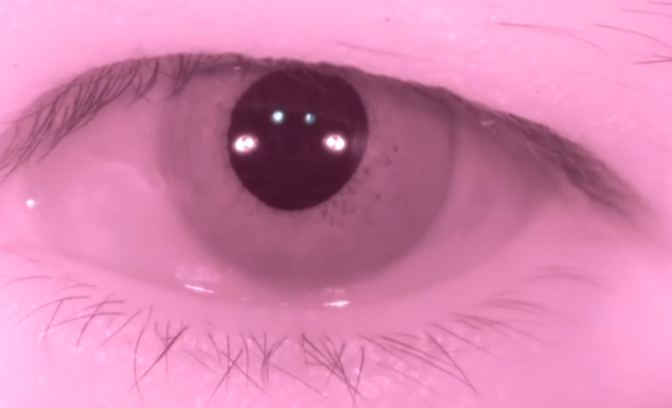
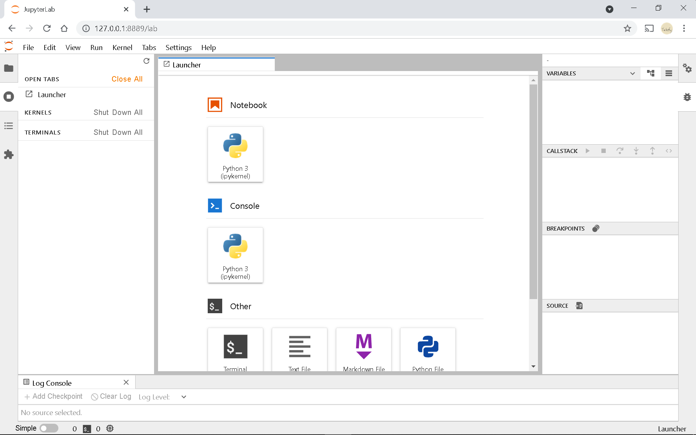
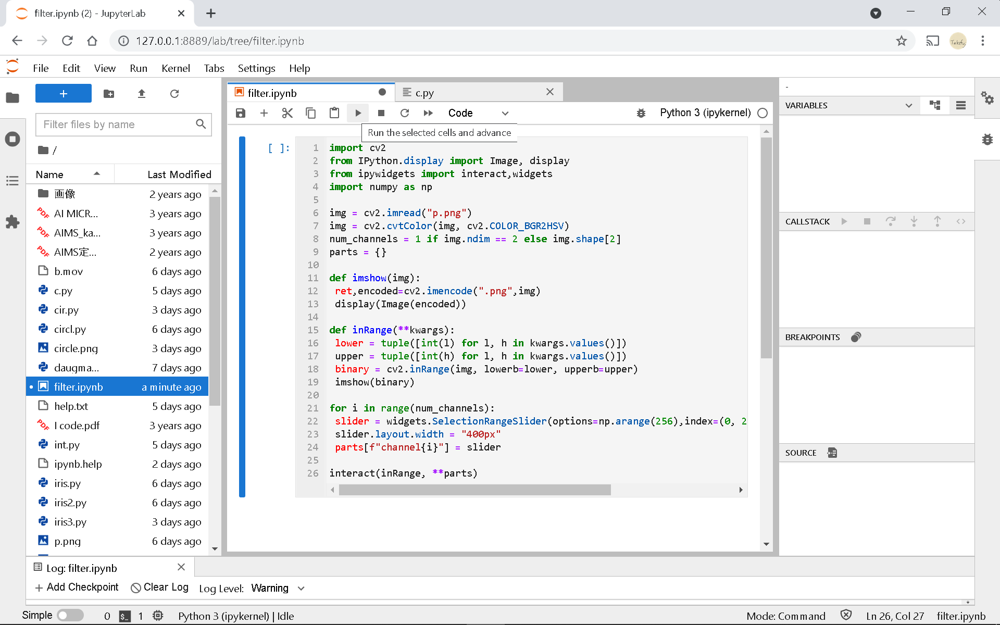
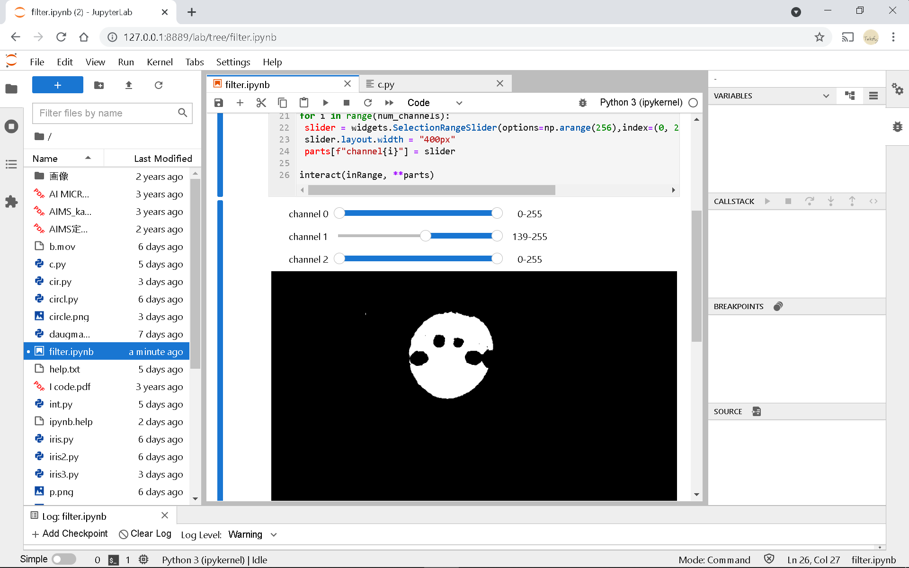
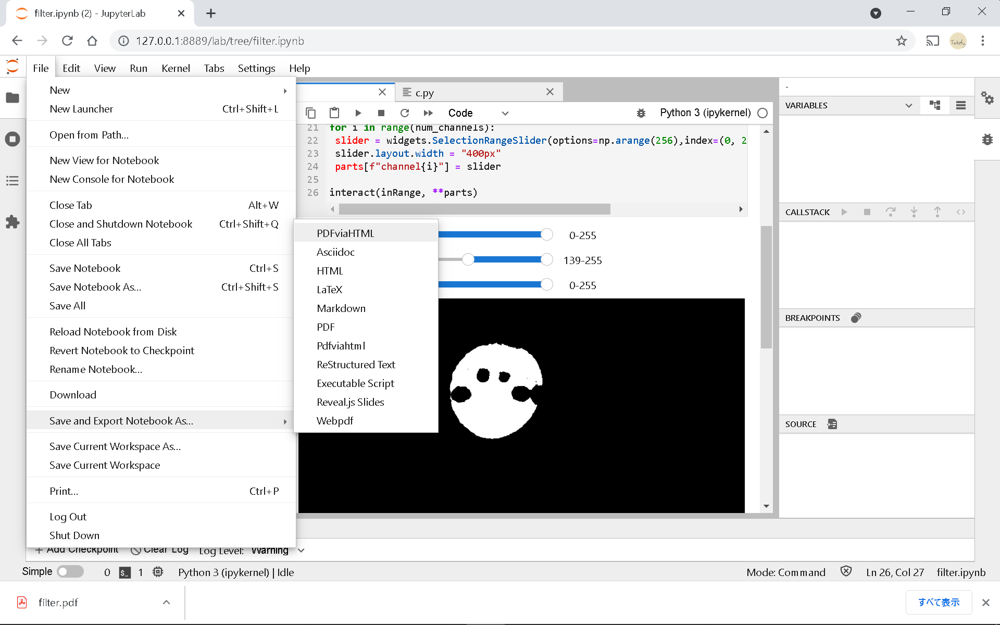

# image_filter
This shows how to interactively build an optimum filter using ipywidgets.
Using the following picture, this example shows how to extract a pupil image.

<pre>
$ pip install -U ipywidgets
$ pip install -U jupyterlab widgetsnbextension
$ pip install -U notebook-as-pdf
run the following command
$ pyppeteer-install

</pre>

# How to run lab
The following command to run jupyter-lab launcher

$ jupyter-lab --no-browser

http address will be shown on the screen.

copy the URL address and past it to browser (chrome or edge).

click Notebook and save Untitle.ipynb file as filter.ipynb. 
And copy the content of c.py file and past it to filter.ipynb

slide channel-1 to 139 to be able to extract a pupil.

In order to save the result as pdf file, choose PDFviaHTML menu.

